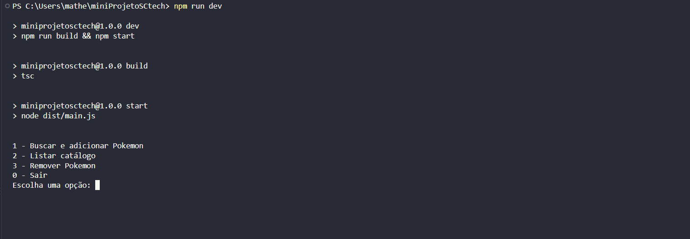
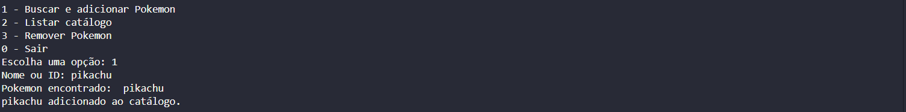
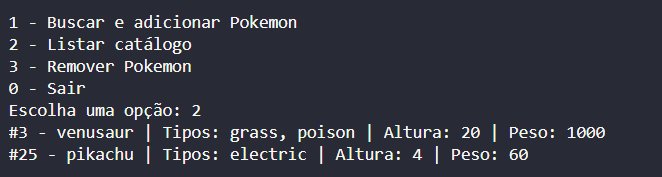
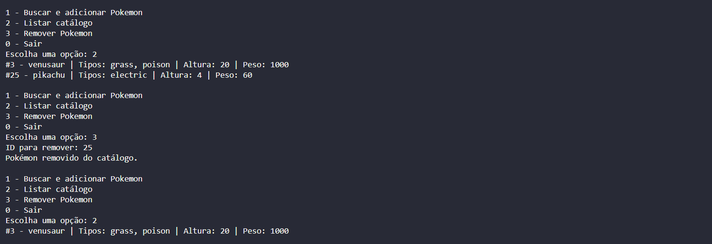
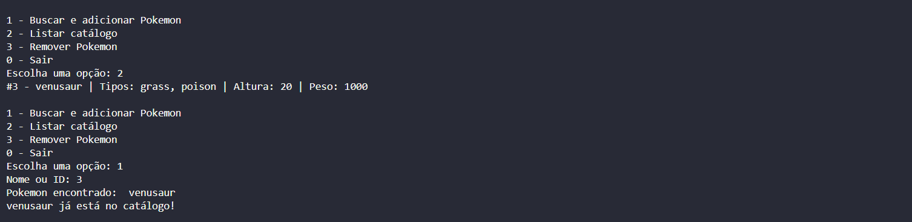

# Mini Projeto SCtech

Aplicação de linha de comando para consulta, cadastro e gerenciamento de Pokémon utilizando a PokeAPI.

## 1. Descrição do projeto

O projeto consiste em uma Pokédex executada no terminal. O usuário pode buscar Pokémon pelo nome ou ID, adicionar os resultados a um catálogo local, visualizar os Pokémon cadastrados e remover itens pelo ID.

O catálogo é persistido no arquivo `pc_box.json`, permitindo que os Pokémon cadastrados sejam mantidos mesmo após o encerramento e a reinicialização do programa.

## 2. Objetivo

Praticar o desenvolvimento de uma aplicação TypeScript com:

- Consumo de uma API externa;
- Mapeamento de dados recebidos;
- Organização do código em modelos, serviços, controladores e utilitários;
- Persistência local utilizando um arquivo JSON;
- Interação com o usuário pelo terminal;
- Uso de operações assíncronas.

## 3. Tecnologias utilizadas

- Node.js;
- TypeScript;
- PokeAPI;
- `readline/promises` para interação com o terminal;
- `fs/promises` para leitura e escrita do arquivo JSON;
- JSON para persistência dos dados.

## 4. Pré-requisitos

Antes de executar o projeto, é necessário ter instalado:

- Node.js;
- npm;
- Git, caso o projeto seja clonado de um repositório.

Também é necessário possuir acesso à internet para consultar a PokeAPI.

Para verificar as instalações:

```bash
node --version
npm --version
git --version
```

## 5. Como instalar

Clone o repositório e acesse a pasta do projeto:

```bash
git clone <URL_DO_REPOSITORIO>
cd miniProjetoSCtech
```

Instale as dependências:

```bash
npm install
```

## 6. Como executar

Para compilar o projeto e executar a aplicação:

```bash
npm run dev
```

Também é possível executar as etapas separadamente:

```bash
npm run build
npm start
```

## 7. Funcionalidades

A aplicação disponibiliza as seguintes opções:

1. **Buscar e adicionar Pokémon**
   - Consulta um Pokémon pelo nome ou ID na PokeAPI;
   - Mapeia os dados principais da resposta;
   - Adiciona o Pokémon ao catálogo;
   - Evita o cadastro duplicado;
   - Persiste o catálogo no arquivo `pc_box.json`.

2. **Listar catálogo**
   - Exibe os Pokémon cadastrados;
   - Mostra o ID, nome e tipos de cada Pokémon.

3. **Remover Pokémon**
   - Remove um Pokémon utilizando seu ID;
   - Atualiza o arquivo local após a remoção.

4. **Persistência de dados**
   - Lê o arquivo `pc_box.json` ao iniciar o programa;
   - Mantém os dados cadastrados entre diferentes execuções.

5. **Tratamento de erros**
   - Informa quando um Pokémon não é encontrado;
   - Valida o ID informado para remoção;
   - Trata erros de consulta à API.

## 8. Exemplos de execução

### Menu inicial




### Busca e cadastro de um Pokémon




### Listagem do catálogo




### Remoção de um Pokémon



### Tratamento de duplicidade de um Pokémon



## 9. Explicação curta dos arquivos

- `src/main.ts`: ponto de entrada da aplicação. Controla o menu interativo e coordena as operações.
- `src/controllers/TerminalController.ts`: encapsula a leitura de dados digitados pelo usuário e o encerramento do terminal.
- `src/models/Pokemon.ts`: define as interfaces dos dados resumidos do Pokémon e da resposta da PokeAPI.
- `src/models/CatalogoPokemon.ts`: contém a classe responsável por carregar, adicionar, listar e remover Pokémon do catálogo.
- `src/models/CustomErrors.ts`: define erros personalizados relacionados à busca de Pokémon.
- `src/services/PokeApiService.ts`: realiza as consultas à PokeAPI e transforma a resposta em um objeto `PokemonResumo`.
- `src/services/BoxService.ts`: lê e grava os dados do catálogo no arquivo `pc_box.json`.
- `src/utils/textFormatters.ts`: contém funções auxiliares para formatar o menu e as informações exibidas no terminal.
- `pc_box.json`: banco de dados local baseado em persistência de arquivos JSON.
- `package.json`: contém as dependências e os scripts de execução do projeto.
- `tsconfig.json`: configura a compilação do TypeScript.

## 10. Link do Kanban

https://trello.com/invite/b/6ab7c77d411df856d02d2645/ATTI9b0e4d9bc9a3061ba79a756189aa39e83DF7B431/mini-projeto-nodejs-typescript-pokemon-api

## 11. Branches utilizadas

- `main`: branch principal e versão estável do projeto.
- `develop`: branch de desenvolvimento e integração das alterações.
- `feat/pokedex`: branch utilizada para o desenvolvimento das funcionalidades da Pokédex.
- `docs/readme`: branch utilizada para a criação e atualização da documentação do projeto.
